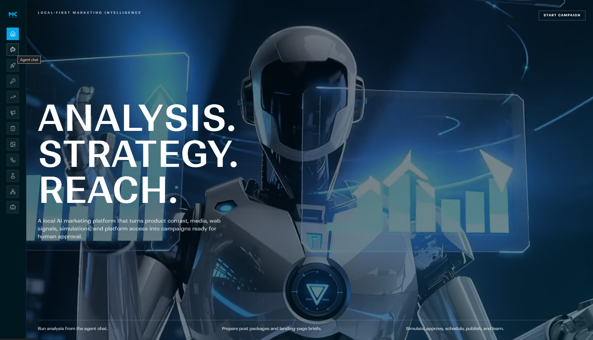
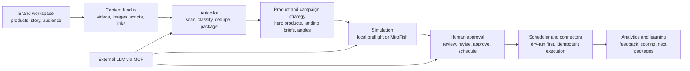
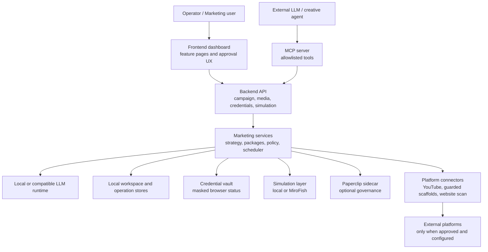

# AI-based Local-First Marketing Agent

**Documentation-only public showcase for a proprietary local-first AI marketing operating system.**

The AI-based Local-First Marketing Agent transforms brand stories, product information, media assets, campaign goals, simulations, approval decisions, platform connections, and analytics feedback into governed multi-platform marketing campaigns.

This repository presents the system as a professional software engineering portfolio artifact. It contains architecture descriptions, workflow diagrams, demo references, screenshots, operating boundaries, and implementation evidence. It does not contain production source code, credentials, prompts, model weights, deployable binaries, private configuration, or customer data.

> Conceptualized, architected, implemented, tested, and deployed end to end by **Martin Khadjavian**.
>
> Demo video: [AI-based Local-First Marketing Agent on YouTube](https://youtu.be/0TN4MeALWmg?si=rEkr6Z4LcSghJnsq)  
> Contact: [martinkhadjavian.com](https://martinkhadjavian.com/)

---

## Demo

[Watch the public-safe Marketing Agent walkthrough on YouTube](https://youtu.be/0TN4MeALWmg?si=rEkr6Z4LcSghJnsq)

[](https://youtu.be/0TN4MeALWmg?si=rEkr6Z4LcSghJnsq)

## Product preview



## Quick links

| Topic | Link |
|---|---|
| Demo video | [Public demo walkthrough](docs/demo/demo_video.md) |
| Architecture | [System architecture](docs/architecture.md) |
| Capabilities | [Feature model](docs/features.md) |
| User workflows | [Operator workflows](docs/user-workflows.md) |
| Autopilot and MCP | [External-agent campaign handoff](docs/campaign-autopilot-and-mcp.md) |
| Simulation and governance | [MiroFish, Paperclip, and approval model](docs/simulation-and-governance.md) |
| Security and privacy | [Public/private boundaries](docs/security-and-privacy.md) |
| Operations and quality | [Verification, scheduler, observability](docs/operations-and-quality.md) |
| Portfolio evidence | [Engineering evidence for interviews](docs/portfolio-evidence.md) |

## What the system does



The platform is designed for long-running, multi-brand, multi-platform campaign work:

- A user or external creative agent places campaign material into a structured content fundus.
- The Marketing Agent scans the folder, identifies topic bundles, deduplicates media, and creates platform-specific post packages.
- Product-growth analysis ranks hero products and prepares landing-page briefs.
- The campaign pipeline applies policy, posting windows, approval state, platform capabilities, and simulation requirements.
- MiroFish can be used as an optional synthetic campaign preflight simulator.
- Paperclip can be used as an optional control plane for governed agent roles, tasks, heartbeats, budgets, and audit trails.
- The MCP server allows authorized external LLMs to operate the Marketing Agent through allowlisted tools without receiving platform secrets.
- Publishing remains approval-gated and dry-run-first. Real external publishing depends on platform permissions, connector maturity, account authorization, and operator approval.

## Core capabilities

| Capability | Portfolio-safe summary |
|---|---|
| Agent Chat | Natural-language command center for analysis, post preparation, scheduling proposals, simulation requests, and campaign status. |
| Campaign Autopilot | Converts large content folders into approval-ready post packages and posting plans. |
| Content Fundus Processing | Classifies media, scripts, story files, brand references, analytics exports, and topic bundles. |
| Product Growth | Ranks hero products, identifies weak products, and prepares landing-page briefs. |
| New Campaign Workflow | Starts structured campaign creation with audience, platform, topic, duration, and brand context. |
| Approval Queue | Keeps a human in control of generated packages before scheduling or publishing. |
| Media Library | Stores campaign assets with stable identity, metadata, source context, and duplicate protection. |
| Processing Pipeline | Checks readiness across packages, media, policy, simulation, approval, platform capability, and scheduling. |
| MiroFish Simulation | Uses optional external multi-agent simulation as campaign preflight decision support. |
| Paperclip Control Plane | Optional agent-company sidecar for role-based tasks, governance status, and mirrored audit records. |
| Credentials | Stores masked credential profiles for social platforms, website/FTP access, MiroFish, Paperclip, and custom connectors. |
| YouTube Governance | OAuth-based channel connection, account detection, workspace-level channel locking, dry-run and real upload path. |
| Scheduler | Processes approved due packages with idempotency and policy checks when invoked by CLI, API, MCP, or service wrapper. |
| Analytics Learning | Imports analytics, extracts lessons, and improves future scoring and recommendations. |
| MCP Orchestration | Enables secure operation by external LLM agents through allowlisted backend tools. |

## Architecture at a glance



Deep dives: [Architecture](docs/architecture.md), [Autopilot and MCP](docs/campaign-autopilot-and-mcp.md), [Simulation and governance](docs/simulation-and-governance.md), [Security and privacy](docs/security-and-privacy.md).

## Repository structure

```text
.
|-- README.md
|-- CHANGELOG.md
|-- LICENSE.md
|-- NOTICE.md
|-- MANIFEST.txt
|-- Marketing_Agent_Screenshot.png
`-- docs/
    |-- architecture.md
    |-- features.md
    |-- user-workflows.md
    |-- campaign-autopilot-and-mcp.md
    |-- simulation-and-governance.md
    |-- security-and-privacy.md
    |-- operations-and-quality.md
    |-- portfolio-evidence.md
    |-- deutsche-kurzbeschreibung.md
    |-- github-repository-description.txt
    |-- demo/
    |   `-- demo_video.md
    |-- source-notes/
    |   `-- diagram-provenance.md
    `-- assets/
        |-- README.md
        `-- demo-video-thumbnail.jpg
```

## Engineering challenges solved

- **Campaign orchestration instead of caption generation:** the system connects brand context, product growth, media, simulation, approval, scheduling, publishing, and analytics learning.
- **Local-first governance:** brand data, media records, packages, approvals, traces, and credential status stay under operator control by default.
- **External agent safety:** MCP enables external LLM orchestration while backend policies, allowlisted tools, human approvals, and credential vault boundaries remain authoritative.
- **Synthetic preflight with real-world humility:** MiroFish can stress-test strategy, but final optimization is based on actual platform analytics.
- **Multi-brand account safety:** workspace-level account assignment and YouTube channel locking reduce the risk of publishing on the wrong channel.
- **Idempotent publishing:** scheduler and connector flows are designed to avoid duplicate live posts after retries.
- **Portfolio-safe architecture evidence:** this repository demonstrates system design without publishing proprietary implementation details.

## Status

Actively developed and tested as a proprietary local-first marketing agent platform. This public repository is documentation-only and exists for portfolio, demonstration, technical discussion, and collaboration screening.

## What is intentionally not included

This repository does not include:

- production source code;
- private prompts or internal chain templates;
- platform credentials, OAuth tokens, API keys, `.env` files, or local secret material;
- model weights or proprietary runtime packages;
- deployable binaries, installers, or service wrappers;
- private campaign assets or unpublished customer/brand data;
- implementation-level schemas, adapters, or connector code.

## Copyright

Copyright (c) 2026 Martin Khadjavian. All rights reserved.  
AI-based Local-First Marketing Agent is proprietary software. This repository is provided for demonstration and portfolio purposes only and does not grant any license to reproduce, reverse-engineer, re-implement, or commercially use the described system.
