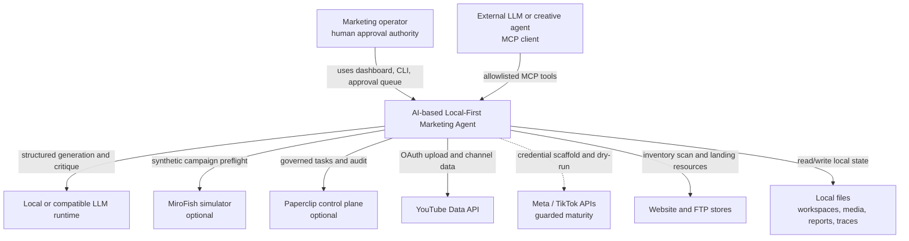
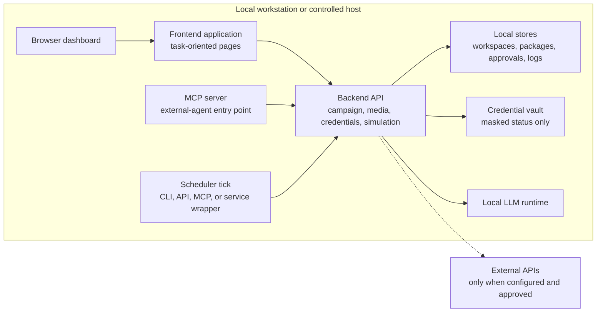
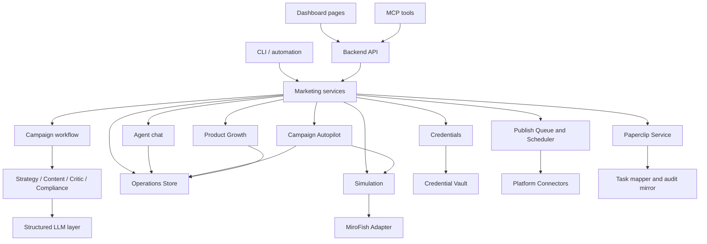
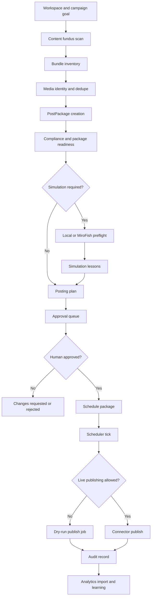

# Architecture

The AI-based Local-First Marketing Agent is a layered, governed marketing platform. It separates user interaction, backend control, campaign orchestration, local persistence, credential handling, simulation, optional sidecar governance, and external platform connectors.

The public documentation intentionally stays at a professional architecture level. It explains responsibilities and flows without publishing source code, internal prompts, schemas, credentials, or deployable implementation details.

## System context

The platform is designed so that external intelligence can help operate the system, but the Marketing Agent backend remains the authority for package state, approval rules, credential access, scheduling, and platform side effects.

## Runtime topology

Default operation is local-first. Remote deployment changes the threat model and requires additional authentication, HTTPS, firewall control, secret rotation, and operational monitoring.

## Main components

| Component | Responsibility |
|---|---|
| Frontend dashboard | Menu-driven operator interface for workspaces, agent chat, autopilot, credentials, product growth, campaign creation, approval, media, pipeline, simulation, Paperclip, and reports. |
| Backend API | Local control plane for dashboard requests, state transitions, jobs, credentials, simulation, product growth, packages, approvals, and connectors. |
| Campaign workflow | Structured campaign generation with strategy, content, critique, compliance, scoring, and report persistence. |
| Agent chat orchestrator | Converts natural-language instructions into safe proposals, package creation, analysis, scheduling suggestions, and status responses. |
| Campaign Autopilot | Scans campaign folders, classifies bundles, deduplicates media, creates packages, requests missing content, and prepares posting plans. |
| Product growth service | Imports product catalogs, ranks hero products, diagnoses weak products, and creates landing-page briefs. |
| Media and operations store | Maintains media records, post packages, approval actions, publish jobs, simulations, analytics, and task mirrors. |
| Credential service | Stores provider profiles, masks browser responses, validates provider configuration, starts OAuth, and scans website/FTP stores. |
| Simulation service | Runs local campaign preflight and optionally coordinates MiroFish graph build, simulation, report generation, and lesson import. |
| Paperclip adapter | Optional sidecar integration for agent-company roles, tasks, heartbeats, budgets, governance status, and audit mirrors. |
| Platform connectors | Connector layer for dry-run and approved live publishing where platform permissions and implementation maturity allow it. |
| MCP server | Allows external LLMs to operate approved Marketing Agent capabilities without direct secret access or policy bypass. |

## Component architecture

## Campaign processing pipeline

This flow is deliberately conservative. Generated content is not equivalent to publishable content until policy, approval, account, connector, and scheduling checks pass.

## Data lifecycle

| Data object | Role |
|---|---|
| Workspace | Brand boundary containing identity, audience, product context, media, account expectations, campaign history, and policy. |
| Media asset | Registered image, video, script, or brand material with source context and duplicate protection. |
| Product record | Imported product data used for hero-product ranking and landing-page strategy. |
| Post package | Durable unit of planned platform content: media, title, description, caption, hashtags, CTA, state, and target platform. |
| Approval action | Append-only record of human review decisions and package lifecycle changes. |
| Campaign policy | Frequency, duration, platform priority, posting limits, risk rules, and approval requirements. |
| Simulation report | Local or MiroFish campaign preflight result and lessons for package improvement. |
| Publish job | Dry-run or live connector execution record with idempotency and outcome. |
| Analytics batch | Imported performance records used for lessons and learned scoring. |

## Extension model

New capabilities should attach to the existing control points:

- new platform connectors join the connector layer and must preserve credential vault, dry-run, idempotency, and approval rules;
- new simulation engines join the simulation service and return normalized lessons;
- new external agents operate through MCP or Paperclip rather than direct file or credential access;
- new campaign optimization models should contribute scores and explanations, not bypass human review;
- new frontend pages should map to a clear backend service and observable state.

This keeps every feature logically attached to the marketing workflow instead of becoming disconnected automation.

