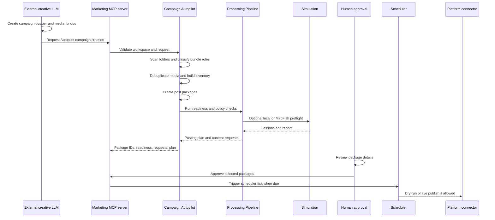

# Campaign Autopilot and MCP

Campaign Autopilot is the bridge between a content factory and a governed marketing execution system. It is especially important when an external LLM or creative agent creates videos, images, scripts, and story material and then hands them to the Marketing Agent.

## Responsibility split

| Actor | Responsibility |
|---|---|
| External creative agent | Create or update media, scripts, product stories, reference images, and campaign dossier files. |
| Marketing Agent | Ingest, classify, deduplicate, create post packages, run preflight, request approval, generate posting plans, execute scheduler ticks, and learn from analytics. |
| Human operator | Define brand intent, approve or reject packages, authorize live platform connections, and decide when a campaign is ready. |

This avoids duplicated logic. The external LLM can be excellent at creative production, while the Marketing Agent remains the governed execution layer.

## Recommended dossier convention

```text
campaign-dossier/
  BRIEF.md
  campaign.yaml
  fundus/
    _brand/
      logo_brand.png
      claims_no_gos.md
      links.md
    01_product_intro/
      script.md
      final_video_9x16_de.mp4
      final_image.jpg
    02_daily_use_case/
      story_daily_use.md
      final_video_9x16_de.mp4
    15_customer_voice/
      script.md
      final_video_16x9.mp4
    analytics/
      youtube_export.csv
```

Use one dossier with many numbered topic bundles when the brand, objective, and time horizon are the same. Use separate dossiers only for truly separate campaigns.

## File role rules

| Pattern | Meaning |
|---|---|
| `fundus/01_*`, `fundus/02_*` | Numbered topic bundles. |
| `fundus/_brand/*` | Brand-level reference context. |
| `fundus/analytics/*` | Analytics inventory for learning and context. |
| `script.md`, `story*.md`, `hooks*.md`, `ideas*.md` | Script and story context. |
| `final_*.mp4`, `final_*.jpg`, `final_*.png` | Ready posting candidates. |
| `raw_*.mp4`, `roh_*.mp4` | Raw production material, not direct posting candidates. |
| `s01_*.png`, `s02_*.jpg` | Ordered scene-frame candidates. |
| `_9x16`, `_16x9`, `_1x1`, `_4x5` | Format hints. |
| `_de`, `_en`, `_es`, `_fr`, `_it`, `_tr`, `_ar` | Language hints. |

## MCP operating model

The MCP server exposes allowlisted tools for external agents. An authorized external LLM can ask the Marketing Agent to ingest a campaign folder, create packages, run simulation, inspect approvals, or process scheduler ticks.

The external agent should not receive:

- platform credentials;
- OAuth tokens;
- raw secret values;
- direct connector access;
- authority to bypass approval;
- unrestricted filesystem or backend access.

## Autopilot sequence



## Posting logic

One approved scheduled package is intended for one execution. The scheduler uses persisted publish-job records and idempotency keys to reduce duplicate live publishing after retry.

The same media can be used on multiple platforms as different packages because each platform has its own metadata, approval state, connector behavior, and schedule.

Evergreen reuse should be handled as a new package or variant with human approval. Identical automatic reposting is intentionally not the default operating model.

