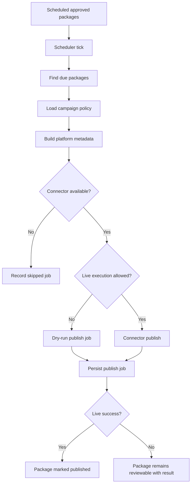

# Operations and Quality

The Marketing Agent was tested as a local-first system with frontend, backend, campaign workflow, dry-run publishing, analytics, learning, and route health checks.

This public document summarizes verification at evidence level and intentionally omits private logs, source code, secret material, and internal deployment paths.

## Verified baseline

| Area | Evidence summary |
|---|---|
| Backend tests | Core backend unit and integration tests passed. |
| Backend lint | Static linting passed. |
| Frontend lint | Frontend linting passed. |
| Frontend build | Production build completed with generated routes. |
| Launcher | Backend, frontend, and API proxy health were verified. |
| Backend health | Local health endpoint returned success. |
| Frontend routes | Menu routes and selected dynamic routes were reachable. |
| Campaign workflow | A stub campaign completed and produced report and trace artifacts. |
| Publishing safety | YouTube dry-run path created an audited publish job without contacting a live platform. |
| Analytics | Existing platform analytics batches summarized successfully. |
| Learning | Learned scorer artifacts were discovered and loaded. |
| Memory | Memory layer initialized in stub mode. |
| Optional services | MiroFish and Paperclip require external services and complete profiles when used. |

## Scheduler operating model

The scheduler is a safe tick-based worker. It processes due packages when invoked by CLI, API, MCP, or a service wrapper.

This model is easier to audit than a hidden always-on publisher. For production use, the tick can be invoked by a supervisor, Windows Task Scheduler, service wrapper, external orchestrator, or MCP-controlled agent.

## Observability

The platform records:

- campaign reports;
- campaign summaries;
- workflow traces;
- media records;
- post packages;
- approval actions;
- publish jobs;
- product-growth reports;
- simulation reports;
- Paperclip task mirrors;
- analytics imports;
- learned lessons and scoring evidence;
- launcher and runtime logs.

These records make the system inspectable and suitable for human-governed marketing operations.

## Quality strategy

Recommended test categories:

- schema validation;
- product CSV parsing;
- package lifecycle transitions;
- approval action persistence;
- credential masking;
- MCP tool authorization;
- Paperclip task mapping;
- MiroFish adapter with mocked HTTP;
- YouTube dry-run and mocked upload;
- scheduler idempotency;
- frontend route availability;
- campaign workflow golden properties.

Golden tests should verify structural behavior instead of exact creative copy. For example, generated outputs should contain expected platforms, valid score ranges, approval states, and compliance decisions.

## Operational rules

- Use dry-run mode during setup and testing.
- Do not enable live publishing until OAuth, account selection, platform permissions, quota, privacy, schedule, and approval state are correct.
- Keep each brand in its own workspace.
- Use one campaign dossier for one brand, one goal, and one time horizon.
- Use content requests to fill gaps instead of duplicating identical content.
- Treat MiroFish as preflight support and analytics as real performance truth.
- Keep platform credentials out of Git and out of public documentation.

