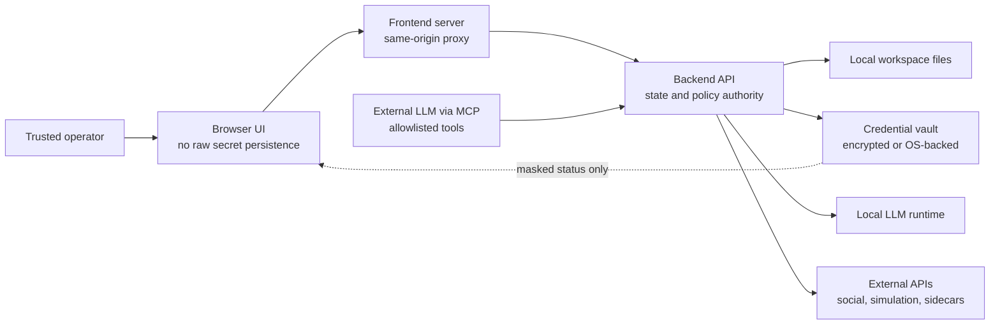

# Security and Privacy

This project is local-first by design. The architecture aims to keep brand data, campaign assets, approvals, logs, reports, and credentials under operator control unless a specific external integration is configured and used.

## Public/private boundary

This public repository includes:

- architecture descriptions;
- workflow documentation;
- portfolio-safe screenshots;
- Mermaid diagrams;
- public demo links;
- operating and security summaries.

This public repository does not include:

- production source code;
- private prompts;
- credentials or OAuth tokens;
- `.env` files;
- connector implementations;
- customer data or unpublished campaign assets;
- deployment payloads;
- internal test fixtures that expose proprietary behavior.

## Trust-boundary model

## Credential handling

Credential profiles are designed to be configured through the frontend while keeping raw secrets backend-side after save.

Important behaviors:

- secrets are not returned to the browser in clear text;
- masked values indicate that a stored secret exists;
- OAuth tokens are treated as backend-managed secrets;
- platform passwords are not the desired operating model;
- platform APIs should be connected through official OAuth or approved API credentials;
- workspace-level account expectations reduce the risk of wrong-account publishing.

## Publishing safety

The system is safe by default:

- human approval is required for high-impact actions;
- agent chat proposes risky actions instead of silently performing them;
- dry-run publishing is the default setup mode;
- successful live publish jobs are persisted to avoid duplicate execution;
- idempotency keys are used around scheduled package execution;
- platform connector maturity is explicit;
- synthetic simulation is labeled as decision support;
- external agents cannot bypass backend policy through MCP.

## Platform maturity

| Platform | Content generation | Credential profile | Dry-run | Real publish | Notes |
|---|---:|---:|---:|---:|---|
| YouTube | Yes | Yes | Yes | Supported when OAuth is connected | Requires correct account/channel, quota, privacy, schedule, and operator approval. |
| Instagram Reels | Yes | Yes | Yes | Guarded scaffold | Real publishing depends on Meta permissions and review. |
| TikTok | Yes | Yes | Yes | Guarded scaffold | Real publishing depends on TikTok approval and available scopes. |
| Facebook | Campaign context | Meta profile | Limited | Not presented as complete | Depends on Meta product permissions. |
| Pinterest | Yes | Yes | Limited | Not presented as complete | Content targeting and profile support exist conceptually. |
| Reddit | Yes | Yes | Limited | Not presented as complete | Content targeting and profile support exist conceptually. |
| Website/FTP | Landing and inventory | Yes | Scan only | Not full deployment | Useful for discovery and landing-page resources. |

## Threats and controls

| Risk | Control |
|---|---|
| Secret exposure in frontend | Backend vault and masked credential status. |
| Wrong account publishing | Workspace account assignment and channel/profile verification where available. |
| Duplicate uploads after retry | Persisted publish jobs and idempotency keys. |
| Unapproved live publishing | Approval gates, dry-run default, connector maturity checks. |
| Unsafe claims | Compliance checks and workspace forbidden-claim context. |
| External agent overreach | MCP allowlists and backend-controlled actions. |
| Paperclip role escalation | Role/action mapping and signed sidecar calls. |
| Treating simulation as fact | MiroFish output treated as synthetic preflight, analytics treated as source of truth. |
| Remote dashboard exposure | Localhost default and recommendation for HTTPS/authentication when exposed. |

## Security posture

The system is built for controlled local or private deployment, not open anonymous public hosting. Any remote deployment should add authentication, HTTPS, firewall rules, secret rotation, backups, monitoring, and operational responsibility for connected platform accounts.

