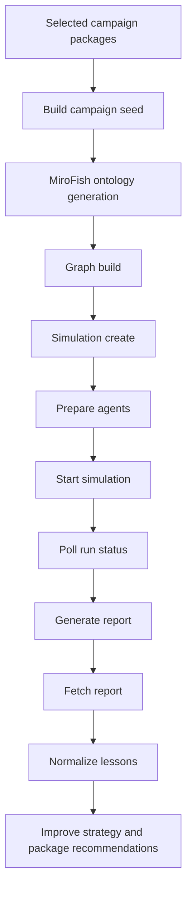
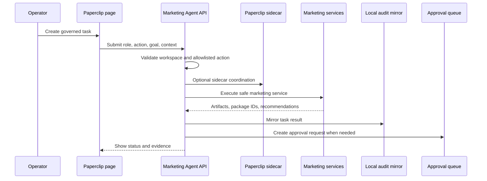

# Simulation and Governance

The Marketing Agent separates prediction support from operational truth. Synthetic simulation can improve campaign decisions before publishing, while real platform analytics remain the source of performance truth after publishing.

## MiroFish campaign preflight

MiroFish is integrated as an optional external simulation layer. The Marketing Agent can create campaign seed material, start the simulation workflow, poll status, fetch reports, and import lessons back into the campaign pipeline.

At a portfolio-safe level, the simulation path is:

MiroFish is useful for:

- stress-testing campaign angles;
- identifying weak messaging;
- comparing buyer-intent hypotheses;
- detecting synthetic audience objections;
- surfacing communication and controversy risks;
- improving hooks, captions, titles, and platform targeting before approval.

MiroFish is not a factual prediction oracle. The system treats it as synthetic decision support, and the operator should compare lessons against real analytics after publishing.

## Local simulation

The local simulation path can run without an external simulator. It provides immediate preflight scoring and package feedback using the local campaign context.

This is useful when:

- MiroFish is not configured;
- the operator needs a fast review loop;
- the campaign is not ready for external simulation;
- a package needs lightweight ranking before human approval.

## Paperclip control plane

Paperclip is integrated as an optional agent-company sidecar. It does not replace the Marketing Agent. It adds governance around delegated tasks.

Paperclip can represent roles such as:

- strategy lead;
- content operator;
- product-growth analyst;
- simulation analyst;
- compliance reviewer;
- publishing coordinator;
- analytics analyst.

The Marketing Agent remains the owner of campaign state and platform safety. Paperclip delegates allowlisted work and mirrors task records, but it does not receive raw platform credentials and cannot publish directly.

## Paperclip sequence

## Human-in-the-loop governance

The governance model is intentionally conservative:

- generated packages are drafts until reviewed;
- approval is required before scheduling and publishing;
- dry-run is the first publishing mode during setup;
- connector maturity is checked before live actions;
- account assignment is checked at workspace level where supported;
- MiroFish feedback is advisory, not authoritative;
- Paperclip tasks are allowlisted by role and action;
- external LLMs operate through MCP tools, not direct secret access.

## Governance principle

The Marketing Agent is designed to let AI do the heavy coordination work while preserving human responsibility for brand judgment, platform authorization, legal/compliance risk, and final publishing approval.

