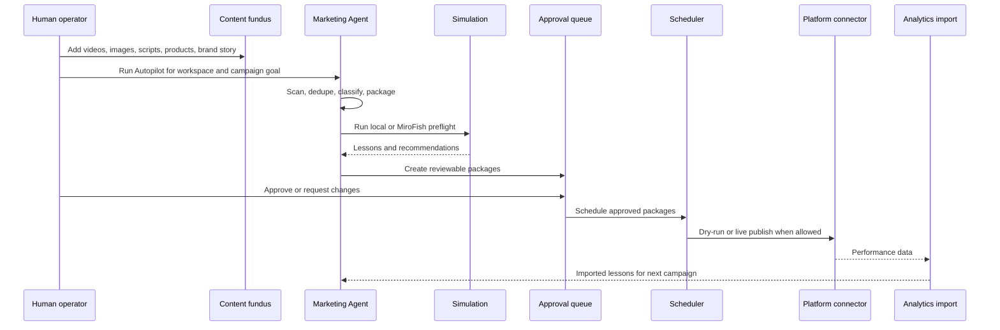

# User Workflows

This document describes the operator-facing workflow in the same order as the application menus. It is written for portfolio review and technical discussion, not as a private installation manual.

## Agent Chat

Agent Chat is the natural-language command center. The operator selects a workspace and asks the agent to analyze a brand, prepare posts, create a campaign, schedule approved work, run simulation, or summarize package status.

The chat layer is conservative. It can create approval-ready packages when enough context exists, but it does not bypass approval or publish directly. High-risk actions are returned as proposals with the next required step.

Typical instructions:

```text
Analyze this workspace and tell me the strongest platform strategy.
```

```text
Prepare YouTube, TikTok, and Instagram packages from the newest approved media.
```

```text
Simulate the strongest packages before scheduling them.
```

## Autopilot

Autopilot converts a large content fundus into a coordinated campaign. It scans a folder, detects numbered topic bundles, reads brand/story context, classifies media, deduplicates assets, and creates post packages across selected platforms.

The operator or an external LLM can prepare the folder. The Marketing Agent owns the processing pipeline afterward: dedupe, package state, simulation handoff, approval queue, posting plan, scheduler execution, and analytics learning.

The recommended workflow is:

1. Create one workspace for the brand.
2. Place campaign materials into one dossier with numbered topic folders.
3. Use one dossier for the same brand, goal, and time horizon.
4. Set target platforms, duration, and packages per platform.
5. Run Autopilot.
6. Review bundle readiness and content requests.
7. Run optional simulation.
8. Approve selected packages.
9. Apply a posting plan only to approved packages.

## Credentials

Credentials manages provider profiles and connection feedback. It is designed so the frontend can configure platform access without exposing raw secrets after save.

Supported credential categories include:

- YouTube;
- Meta, Instagram, and Facebook;
- TikTok;
- Pinterest;
- Reddit;
- website, FTP, and FTPS stores;
- MiroFish;
- Paperclip;
- custom connector profiles.

OAuth-based platforms identify the authorized account instead of asking for social-media passwords. YouTube can retrieve channel identity and supports workspace-level channel expectations, which reduces the risk of publishing a campaign to the wrong channel.

## Product Growth

Product Growth starts from a product catalog and produces campaign prioritization. The operator imports product data, defines strategic context, chooses a hero-product count, and runs the analysis.

The output identifies stronger products, weaker products, strategic rationale, and landing-page briefs. This gives the campaign a commercial direction before the content engine generates platform variants.

## New Campaign

New Campaign starts the typed campaign workflow. The operator defines objective, audience, target platforms, duration, topics, language, workspace, and generation options.

The backend creates a campaign job and writes a report when complete. The report can be reviewed directly, and selected content can become durable post packages for approval.

## Approval

Approval is the human-in-the-loop control surface. Generated packages are inspected before they can move toward scheduling or publishing.

The operator reviews:

- media reference;
- platform;
- title;
- description;
- caption;
- hashtags;
- call to action;
- hypothesis;
- intended schedule;
- lifecycle state.

Packages can be approved, rejected, revised, or scheduled. Approval actions are recorded so decisions are auditable.

## Media

Media is the workspace asset library. It stores videos, images, scripts, usage notes, and creative references that can be reused across campaigns.

The system assigns stable media identity and duplicate protection so a campaign can draw from a growing fundus without repeatedly creating identical packages.

## Pipeline

The pipeline checks whether a campaign is ready to proceed. It evaluates the package set, media availability, approval state, policy, scheduling windows, platform capability, credential state, and simulation requirements.

When simulation is enabled, the pipeline can incorporate MiroFish feedback before final scheduling recommendations. Approved and due packages can then be handled by the scheduler.

## Simulation

Simulation is the Campaign Preflight Lab. It can run a local strategic simulation immediately, or use MiroFish when the external service is configured.

MiroFish is treated as synthetic preflight support, not as a guarantee of views, buyers, or real-world outcomes. It is useful for testing messaging, positioning, buyer intent, and communication risk before publishing.

## Paperclip

Paperclip is an optional sidecar control plane. It helps organize governed agent roles and tasks, while the Marketing Agent remains responsible for strategy, package state, simulation, approval, scheduling, and platform safety.

Paperclip can delegate allowlisted actions such as campaign generation, package creation, product-growth analysis, simulation, compliance review, approval requests, and scheduling of already approved packages.

## Workspaces

Workspaces define brand boundaries. Each workspace can contain brand identity, audience assumptions, product context, media library, website links, platform account expectations, campaign history, policies, and operation logs.

For multi-brand operation, each brand should have its own workspace. This prevents one brand's media, credentials, or posting policy from leaking into another campaign.

## End-to-end operator workflow



This workflow makes the human the authority for approval and brand judgment, while the agent performs the repetitive orchestration, packaging, scheduling, and learning work.

